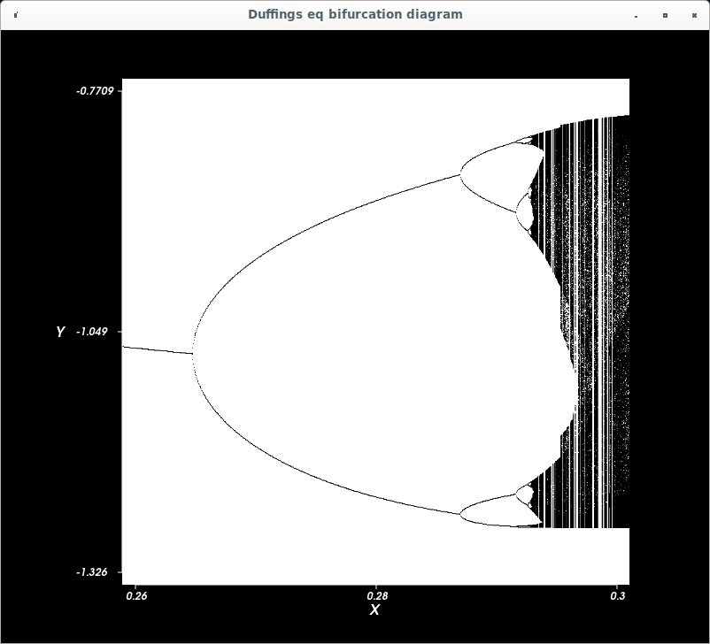

This directory holds stuff I created while writing a program to
integrate Duffing's equation using methods from the Sundials numerical
library,

https://computing.llnl.gov/projects/sundials

The codes are:

test.cpp -- just a throw-away test of how to use the sciplot library
as well as what parameters I need in order to build using g++.

runDuffingsEq.cpp -- program which integrates Duffing's equation over
time and then makes plots of the time series.

sampleDuffingsEq.cpp -- sweeps through gamma values, periodically
samples the time series and then makes a plot of fixed points
vs. gamma.  The goal is to plot the period-doubling cascade to chaos.

----------------------------------------------------------
To build this stuff:

mkdir build   
cd build   
cmake -S .. -B ..   
cd ..   
make  

Jan 2022.

